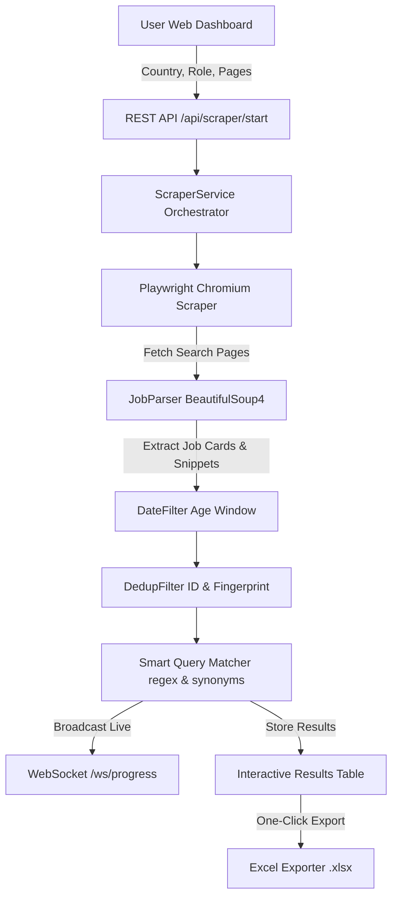

# Indeed Job Lead Scraper

> **Automated Global Job Lead Generation Platform**
> 
> Scrapes Indeed across **21+ countries**, applies **smart regex keyword & synonym matching**, deduplicates leads, and generates formatted Excel reports — all managed via an interactive, real-time web dashboard.

---

## ⚡ Quick Start (3 Steps)

### 1. Install Dependencies

```powershell
python -m pip install -r requirements.txt
playwright install chromium
```

### 2. Configure Environment

```powershell
copy .env.example .env
```

*(Defaults in `.env` are ready to run out of the box — no API keys required!)*

### 3. Launch Application

```powershell
python main.py
```

Open your browser at **[http://localhost:8000](http://localhost:8000)**.

---

## ✨ Key Features

- 🌍 **Multi-Country Search**: Select target countries (India, US, UK, Canada, Australia, Germany, UAE, South Africa, etc.) from an intuitive dropdown.
- 🎯 **Smart Keyword & Synonym Matching**:
  - Uses exact regex word boundaries (`\b`) for short 2-letter technical acronyms (`AI`, `ML`, `UI`, `UX`, `QA`, `IT`, `DB`, `C#`).
  - Automatic synonym expansion for **AI/ML** (`AI`, `Artificial Intelligence`, `GenAI`, `Generative AI`, `LLM`, `Machine Learning`, `Deep Learning`, `NLP`) matching standard roles (`Developer`, `Engineer`, `Specialist`, `Programmer`).
  - Eliminates false positive matches (e.g. keeps ServiceNow or Frontend Developer jobs out of AI Developer search results).
- ⚡ **Stealth Scraping Engine**: Built with Playwright Chromium, anti-detection evasions, configurable delays, and automatic retries.
- 📊 **Real-time Live Dashboard**:
  - Live WebSocket progress bar (0% to 100%) with animated status indicators.
  - Interactive lead table with instant client-side title & company search.
  - Streaming execution logs.
- 🧹 **Deduplication & Age Filtering**:
  - Dual-layer deduplication (Indeed Job ID `jk` + MD5 title/company fingerprint).
  - Filters postings by age window (default: last 30 days / configurable).
- 📥 **One-Click Excel Download**: Formatted `.xlsx` workbooks with auto-fitted column widths and active Indeed job URL hyperlinks.

---

## 🔄 Pipeline Data Flow



---

## 📁 Repository Structure

```text
c:\Projects\Indeed Scraper\
├── main.py                         # Application Entry Point (FastAPI + Uvicorn)
├── .env.example                    # Configuration Template
├── .env                            # Active Environment Configuration
├── requirements.txt                # Python Dependencies
├── README.md                       # Project Overview & Setup (THIS FILE)
├── DEVELOPER_GUIDE.md              # Developer Architecture & Directory Guide
│
├── app/                            # Core Source Code
│   ├── config/                     # Settings & Country Mappings
│   │   ├── constants.py            # Country list & domain resolver
│   │   └── settings.py             # Pydantic BaseSettings
│   │
│   ├── models/                     # Pydantic Data Models
│   │   ├── job.py                  # JobPosting schema
│   │   └── scraper.py              # ScraperProgress & RunConfig models
│   │
│   ├── scraper/                    # Scraping Engine
│   │   └── indeed_scraper.py       # Playwright Chromium scraper
│   │
│   ├── parser/                     # HTML Parser
│   │   └── job_parser.py           # BeautifulSoup4 extractor & snippet parser
│   │
│   ├── filters/                    # Pipeline Filters
│   │   ├── date_filter.py          # Date window filter
│   │   └── dedup_filter.py         # Job ID & MD5 fingerprint deduplication
│   │
│   ├── excel/                      # Report Generator
│   │   └── exporter.py             # Openpyxl Excel exporter with hyperlinks
│   │
│   ├── services/                   # Service Layer
│   │   └── scraper_service.py      # Pipeline Orchestrator
│   │
│   ├── dashboard/                  # FastAPI & WebSocket
│   │   ├── router.py               # REST API & HTML template routes
│   │   └── websocket.py            # Live progress WebSocket manager
│   │
│   └── utils/                      # Utilities
│       ├── helpers.py              # Query matcher, date parser, URL builder
│       └── logger.py               # Loguru logging configuration
│
├── templates/                      # HTML Interface (Jinja2 + TailwindCSS)
│   ├── base.html                   # Layout template
│   └── index.html                  # Single-Page Dashboard Interface
│
├── static/                         # Frontend Assets
│   ├── css/custom.css              # Custom styling & animations
│   └── js/app.js                   # WebSocket & SPA logic
│
├── logs/                           # Log files (ignored in git)
└── outputs/                        # Exported Excel workbooks (ignored in git)
```

---

## ⚙️ Configuration Reference

All application settings are managed via `.env`:

| Setting | Default | Description |
|---|---|---|
| `SCRAPER_HEADLESS` | `true` | Runs Chromium browser in background mode |
| `SCRAPER_DELAY_MIN` | `2.0` | Minimum delay (seconds) between page requests |
| `SCRAPER_DELAY_MAX` | `5.0` | Maximum delay (seconds) between page requests |
| `SCRAPER_RETRY_ATTEMPTS` | `3` | Max retry attempts per search page |
| `FILTER_MAX_AGE_HOURS` | `720` | Maximum job posting age in hours (720 = 30 days) |
| `DASHBOARD_PORT` | `8000` | Local port for FastAPI web interface |
| `OUTPUT_DIR` | `outputs` | Directory path for generated Excel files |
| `LOG_DIR` | `logs` | Directory path for rotating log files |

---

## 🛠️ Technology Stack

| Layer | Technology |
|---|---|
| **Web Framework** | FastAPI + Uvicorn |
| **Frontend** | HTML5, JavaScript (ES6), TailwindCSS, Jinja2 Templates |
| **Real-time Communication** | WebSockets (`/ws/progress`) |
| **Scraping Engine** | Playwright (Chromium Async API) |
| **HTML Parsing** | BeautifulSoup4 + lxml |
| **Excel Export** | openpyxl |
| **Data Validation** | Pydantic v2 (with `@computed_field`) |
| **Logging** | Loguru |

---

## 📄 License

Internal / Business Tool — Desire Infoweb Pvt. Ltd.
